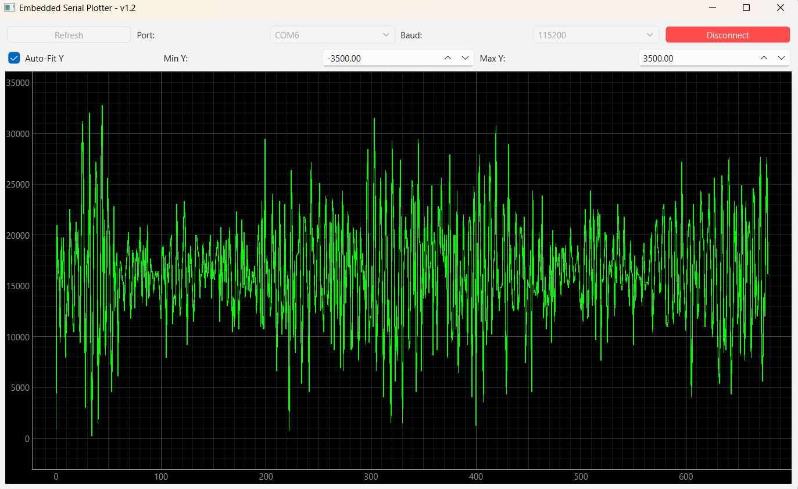

---

# 📈 Embedded Serial Plotter

A lightweight, high-performance real-time data visualizer built with **Python**, **PyQt6**, and **pyqtgraph**. This tool is designed for embedded developers who need to visualize sensor data (Analog, PCM, etc.) directly from a serial port without the overhead of heavy IDEs.

## ✨ Features
* **Real-time Plotting:** High-frame-rate visualization using GPU-accelerated graphics.
* **Dynamic UI Controls:**
    * **Port Scanner:** Automatically detects available COM/Serial ports.
    * **Baudrate Selection:** Supports standard and high-speed rates (up to 2M).
    * **Interactive Y-Axis:** Toggle between **Auto-Fit** and **Manual** scaling via the UI.
* **UI Locking:** Safety feature that prevents port setting changes while a connection is active.
* **Cross-Platform:** Works on Windows (Git Bash/CMD) and Linux.

---

## 🚀 Getting Started

### 1. Prerequisites
Ensure you have Python 3.8+ installed. It is recommended to use a virtual environment.

```bash
# Create a virtual environment
python -m venv .venv

# Activate it (Git Bash)
source .venv/Scripts/activate

# Install dependencies
pip install pyserial pyqt6 pyqtgraph numpy
```

### 2. Microcontroller Setup
Your firmware should print data to the serial port in a simple numeric format followed by a newline:

```c
// C / C++ Example
printf("%.3f\n", sensor_value);
```

### 3. Running the Plotter
1.  Connect your microcontroller to your PC.
2.  Run the script:
    ```bash
    python plotter.py
    ```
3.  Click **Refresh**, select your **Port** and **Baudrate**, and hit **Connect**.

---

## 🛠️ Project Structure
* `plotter.py`: The main Python application.
* `.venv/`: Virtual environment (ignored by Git).
* `README.md`: Project documentation.

---

## 📝 Planned Features
- [ ] **Multi-Channel Support:** Plot multiple variables separated by commas.
- [ ] **Record to CSV:** Export live data to a file for analysis.
- [ ] **Triggering:** Pause the plot when a certain value threshold is met.
- [ ] **Dark/Light Mode:** Customizable UI themes.

---

## ⚖️ License
MIT License - Feel free to use this for your own hardware debugging!

---